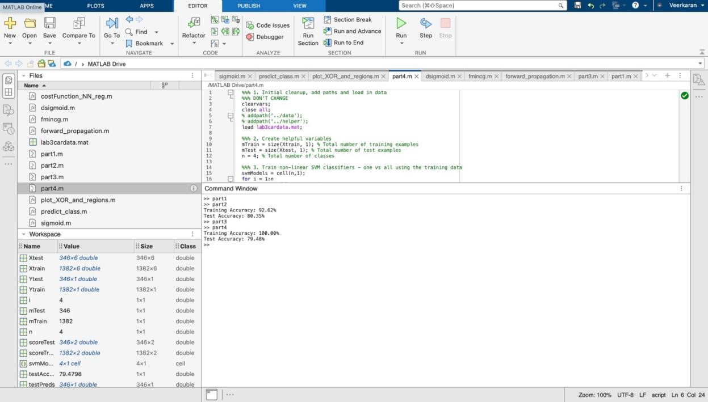

**Neural Networks**

**Objective:** To implement the understanding of Neural Networks for
binary class classification and multi-class classification and
experimenting with different number of neurons in the hidden layer and
understand its effects.

**Methodology**: Using the file Final Project.pdf, we thoroughly
understood the instructions on how to do the assignment and understand
the concepts related to neural networks in a more efficient manner.

**Data Files:** *lab3cardata.mat* is the file which provides us data set
which consists of 6 features to identify the acceptable rating of car to
mark it out if it is 'fit to drive' or not.

**Program Files**: *sigmoid.m* is used to calculate the sigmoid of all
elements inserted in the input array.

*dsigmoid.m* calculates the derivative of each of the sigmoid function
values to go in the array.

*forward_propagation.m* is used to perform the forward propagation on
the data matrix where it goes from the input layer to the hidden layer
and from the hidden layer to the output layer.

*predict_class.m* is used to predict the class of the input dataset
corresponding to the nearest weights. *part1.m* is used to solve the XOR
problem with Gradient Descent using neural networks.

*costFunction_NN_reg.m* is used to calculates the accuracy of the
outputs predicted where it returns the gradients of the weights and
performs regularization on the dataset. It calculates the cost to use
those weights in neural network as well as the gradient vector where
each weight has its error gradient evaluated at these current weights.
*part2.m* is used to predict the optimal car acceptability using the
training dataset.

*part3.m* is used to recalculate the results of part 1 with the use of
Support Vector Machines (SVMs) to solve the XOR problem. *part4.m*
recalculates the results of part 2 using SVMs to solve the car
acceptability.

*plot_XOR_and_reqgions.m* is used to plot the XOR graph and plotting the
decision boundaries for each class with the provided matrices.

*fmcing.m* is used to calculate the minimum of a cost function using the
conjugate gradient method to calculate the minimum.

**Outputs:**

{width="6.5in" height="3.704861111111111in"}

*Figure 1: Displays the learning using neural networks*

{width="6.5in" height="3.7131944444444445in"}

*Figure 2: Creating the prediction model and calculating its accuracy*

{width="6.5in" height="3.7131944444444445in"}

*Figure 3: Drawing the SVM decision boundary for XOR graph*

{width="6.5in" height="3.6972222222222224in"}

*Figure 4: Creating the prediction model and calculating its accuracy
using SVM*

**Conclusion:** This assignment provided us a clear understanding of
neural networks. We plotted a graph and drew a decision boundary to
signify different classes. We used sigmoid and dsigmoid to calculate the
g(z) and the derivative of g(z) respectively. In addition, we made
predication and calculated its accuracy.
